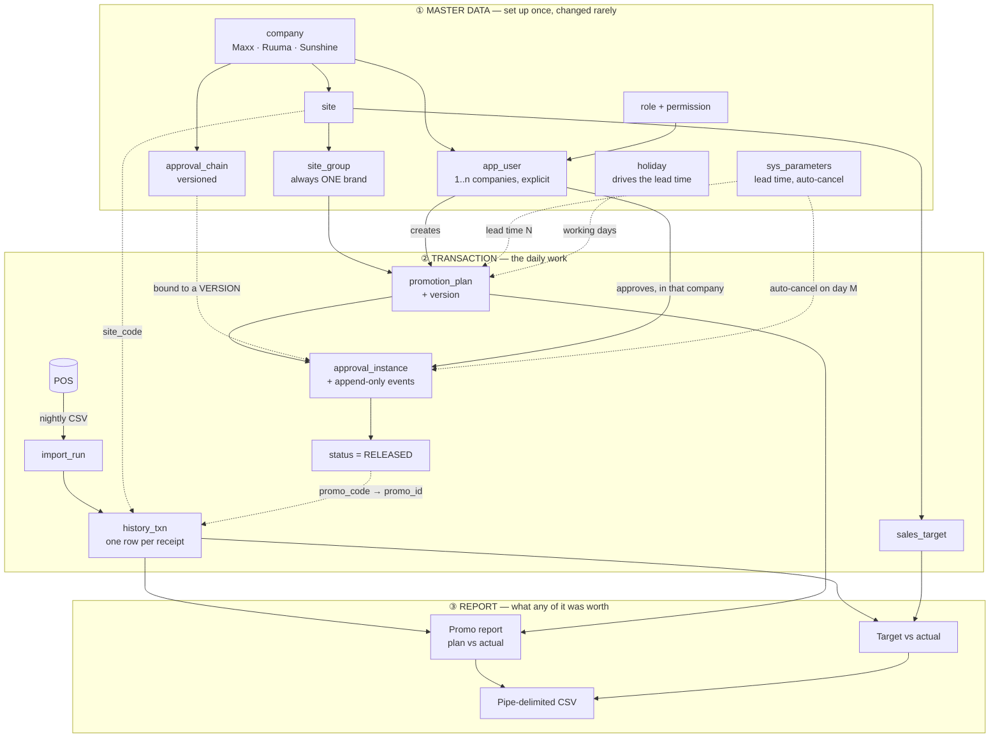
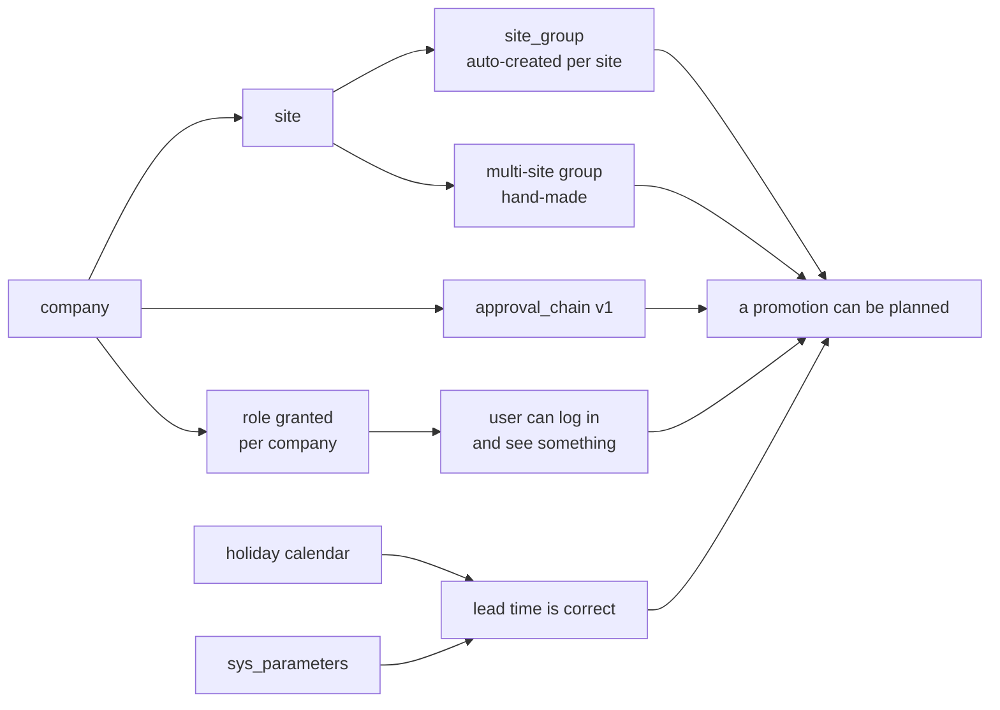
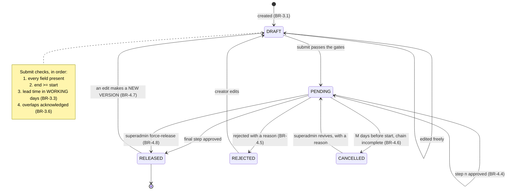
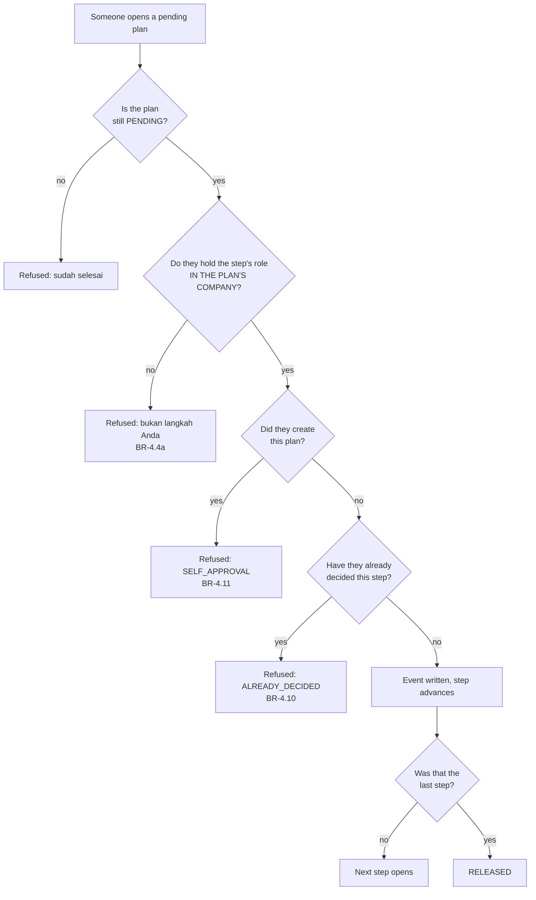
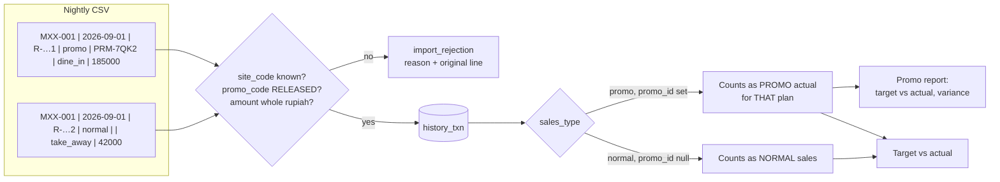
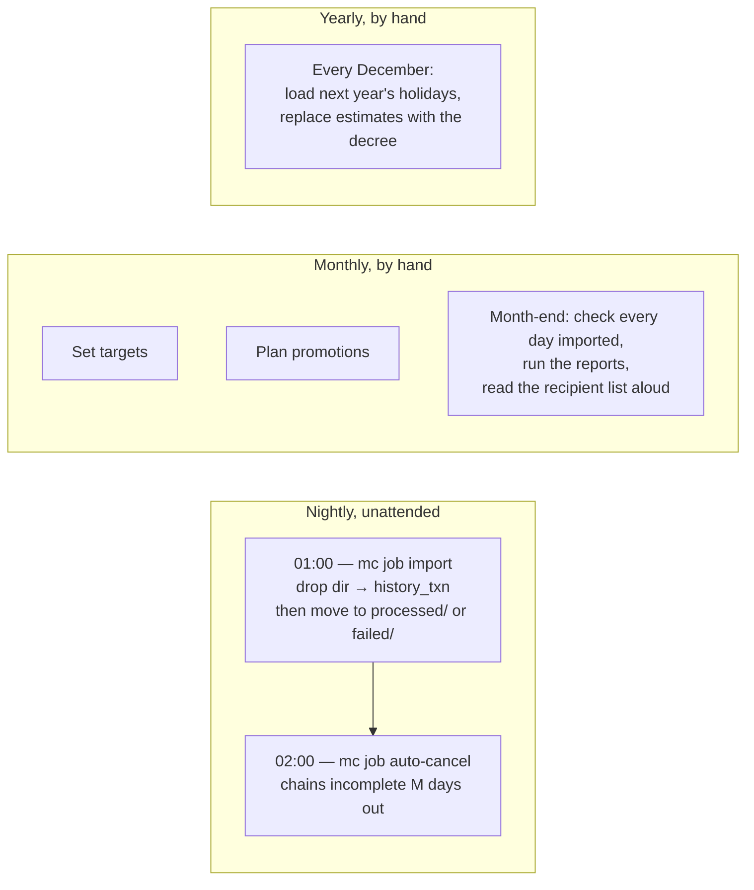
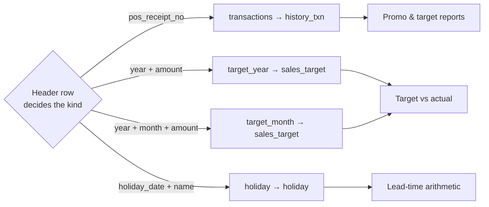

# 02a — General flow: master data → transaction → report

**The visual companion to `02-business-rules.md`.** Same `BR-x.y` IDs, drawn
rather than written. Where this disagrees with `02`, `02` is right.

**Date:** 2026-09-07

---

## 1. The whole thing on one page

Solid arrows are **things that flow**. Dotted arrows are **things that
constrain** — the parameter that decides a date, the chain version an instance
is pinned to, the released plan an imported row is allowed to point at.

---

## 2. Setup order — nothing here is optional

You cannot skip a box. Each one is the foreign key of the next.

| Skip this | What happens |
|---|---|
| A company | Nothing else can exist; every table carries `company_id` |
| A site | No site group, so nothing to target |
| A role grant | The user logs in successfully and **sees nothing**. Not an error — deny by default is the resting state (BR-5.1) |
| An approval chain | Submitting refuses: *"tidak ada rantai persetujuan aktif"* |
| The holiday calendar | Lead time computes on weekdays alone and returns a date the rule never allowed — **and the number still looks like seven** (BR-3.3) |

---

## 3. A promotion, end to end

**The one that matters:** `RELEASED → DRAFT` is not an edit. It creates
**version n+1** and re-enters the chain at step 1. Version n stays readable,
exactly as it was approved. If an approved plan could be edited, the approval
would mean nothing.

---

## 4. Who may approve, and when

All five refusals are named codes, not a generic 403 — an approval screen that
says only "forbidden" is impossible to debug.

Two approvers acting at the same instant are serialised by
`SELECT … FOR UPDATE` inside one transaction, with a partial unique index
behind it. Exactly one wins; the other reads the step that has already moved.

---

## 5. Where a number in a report comes from

This is the subtle one, and the place a report most easily flatters itself.

> **Actuals are attributed by `promo_id`, never by date range (BR-7.6).**
> A transaction inside a promotion's dates but not tagged with its id is normal
> sales. Counting it as promo revenue would make every promotion look better
> than it was, and a `CHECK` constraint stops a `normal` row carrying a
> `promo_id` at all.

---

## 6. The three clocks

Both jobs are **idempotent**: re-running one, or catching up a missed day,
does the right thing. Import identity is the file's **checksum**, not its name.

---

## 7. What each import kind touches

The kind comes from the **header, never the filename**: the drop directory is
unattended, and a file renamed by hand must still be parsed by what is in it.

---

## 8. Reading this against the rules

| Flow step | Rules that govern it |
|---|---|
| Site → site group | BR-1.3 (one brand, enforced by composite FK) |
| User → company | BR-5.4 (explicit, one or more, no wildcard) |
| Plan → submit | BR-3.1, BR-3.2, BR-3.3, BR-3.5, BR-3.6 |
| Submit → chain | BR-4.1, BR-4.2, BR-4.3 (bound to a version) |
| Approve | BR-4.4, BR-4.4a, BR-4.10, BR-4.11 |
| Release | BR-4.12 (fixed recipient list) |
| Edit after approval | BR-4.7 (new version, chain restarts) |
| Auto-cancel | BR-4.6 |
| CSV → history_txn | BR-6.1 … BR-6.6 |
| Targets | BR-2.1 … BR-2.7 (**BR-2.3: months need not sum to the year**) |
| Report | BR-7.5, BR-7.6, BR-7.7 |
| Anything audited | BR-8.1 … BR-8.5 |
