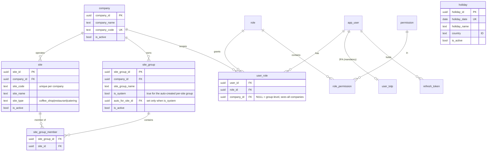
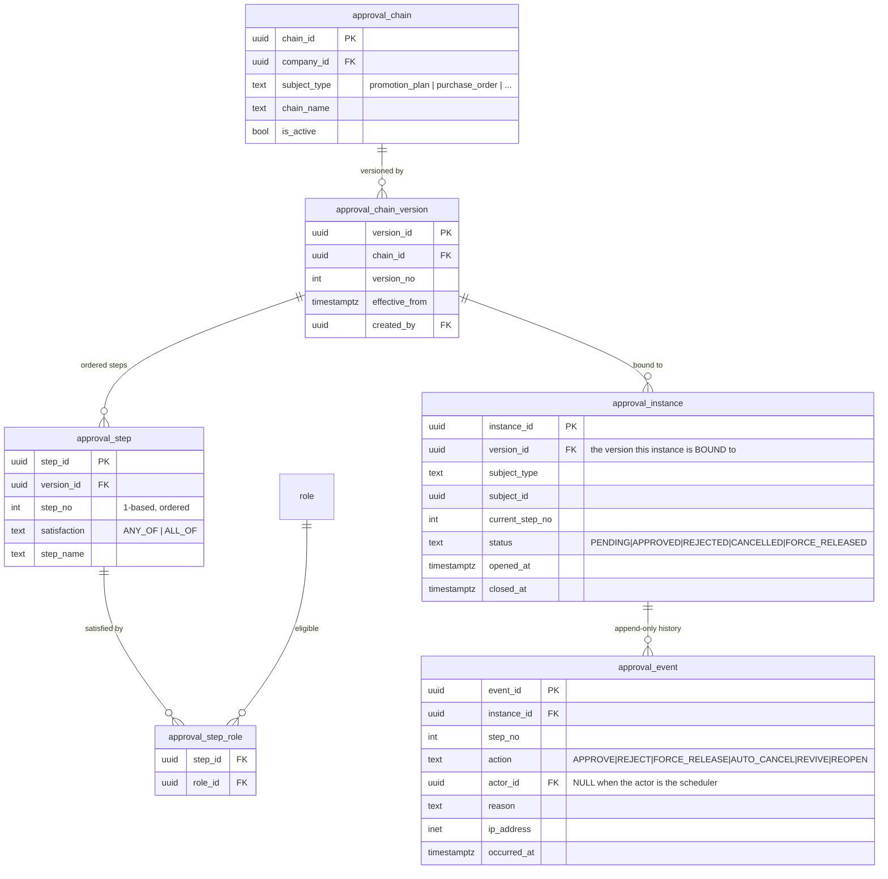
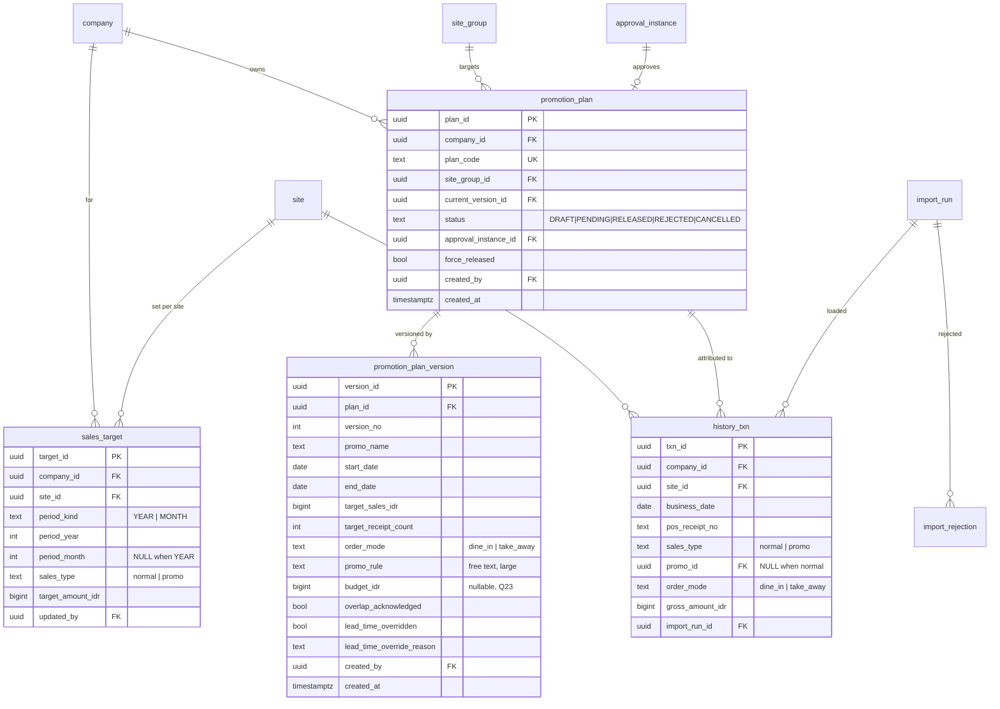

# 03 — Data model

**Date:** 2026-09-01 · Implements `02-business-rules.md`. Where the two
disagree, `02` wins.

PostgreSQL (latest major). Keys are UUIDv7. Money is `BIGINT` whole rupiah.
Timestamps are `timestamptz` in UTC; business dates are `date` evaluated in
`Asia/Jakarta`.

---

## 1. Bounded areas

| Area | Tables |
|---|---|
| Platform | `sys_parameters`, `audit_log`, `notification_log`, `idempotency_key`, `job` |
| Identity | `app_user`, `role`, `permission`, `role_permission`, `user_role`, `refresh_token`, `user_totp` |
| Master data | `company`, `site`, `site_group`, `site_group_member`, `holiday` |
| Approval | `approval_chain`, `approval_chain_version`, `approval_step`, `approval_step_role`, `approval_instance`, `approval_event` |
| Marketing | `sales_target`, `promotion_plan`, `promotion_plan_version` |
| Facts | `history_txn`, `import_run`, `import_rejection` |

---

## 2. ERD — master data and identity



**Notes**

- `site_group` is many-to-many via `site_group_member` (**BR-1.3**, D23). The
  brief's `site_group(site_id)` shape could not express a multi-site group.
- Creating a site creates its system group in the same transaction. That group
  is not deletable and its membership is not editable.
- `user_role.company_id IS NULL` means group-level: the role applies across all
  companies (**BR-5.4**).

---

## 3. ERD — approval



**The load-bearing detail:** `approval_instance.version_id` points at a
**chain version**, not a chain. An administrator editing the chain creates a
new version; instances already open keep pointing at the old one. That is
**BR-4.3** ("changes affect only new plans") expressed as a foreign key rather
than as application discipline.

`approval_step.satisfaction = 'ANY_OF'` with two roles is how
`Role_3 OR Role_4` is stored.

---

## 4. ERD — marketing and facts



**Notes**

- The substantive promotion fields live on **`promotion_plan_version`**, not on
  `promotion_plan`. That is **BR-4.7** ("approval locks the plan; an edit
  creates a new version") made structural: an approved version is simply never
  written to again.
- `history_txn` is **one row per receipt** (**BR-6.2**, D6). Receipt count is
  `count(*)`, which is why the grain matters and why it cannot be changed later.
- `history_txn.order_mode` exists because a promotion is planned for one mode
  and the actual has to be attributable (**D24**).

---

## 5. DDL — the parts that carry the invariants

Only the constraints that enforce a business rule are shown; the full DDL lives
in `db/migrations/`.

### 5.1 Money and non-negativity

```sql
ALTER TABLE sales_target
  ADD CONSTRAINT sales_target_amount_non_negative
      CHECK (target_amount_idr >= 0);                       -- BR-2.4

ALTER TABLE promotion_plan_version
  ADD CONSTRAINT promo_targets_non_negative
      CHECK (target_sales_idr >= 0 AND target_receipt_count >= 0);  -- BR-3.5

ALTER TABLE history_txn
  ADD CONSTRAINT history_txn_amount_non_negative
      CHECK (gross_amount_idr >= 0);
```

### 5.2 The date range

```sql
ALTER TABLE promotion_plan_version
  ADD CONSTRAINT promo_period_ordered
      CHECK (end_date >= start_date);                       -- BR-3.2
```

### 5.3 Target grain

```sql
-- BR-2.1/2.2: one target per site, period and sales type.
CREATE UNIQUE INDEX sales_target_uk
    ON sales_target (site_id, period_kind, period_year,
                     COALESCE(period_month, 0), sales_type);

ALTER TABLE sales_target
  ADD CONSTRAINT sales_target_period_shape CHECK (
      (period_kind = 'YEAR'  AND period_month IS NULL) OR
      (period_kind = 'MONTH' AND period_month BETWEEN 1 AND 12));
```

> **There is deliberately no constraint that the twelve month targets sum to
> the year target.** BR-2.3 says over or under is valid. A future reader will
> be tempted to add one; the absence is the rule.

### 5.4 Transaction idempotency

```sql
-- BR-6.3: re-importing the same file inserts nothing.
CREATE UNIQUE INDEX history_txn_receipt_uk
    ON history_txn (site_id, business_date, pos_receipt_no);

ALTER TABLE history_txn
  ADD CONSTRAINT history_txn_promo_consistency CHECK (
      (sales_type = 'promo'  AND promo_id IS NOT NULL) OR
      (sales_type = 'normal' AND promo_id IS NULL));        -- BR-7.6
```

That second constraint is what stops a `normal` row carrying a promotion id and
being double-counted in the promo report.

### 5.5 Approval integrity

```sql
-- BR-4.10: one decision per approver per step.
CREATE UNIQUE INDEX approval_event_one_per_actor_step
    ON approval_event (instance_id, step_no, actor_id)
 WHERE action = 'APPROVE' AND actor_id IS NOT NULL;

-- BR-4.2: a step is ordered within its version.
CREATE UNIQUE INDEX approval_step_order_uk
    ON approval_step (version_id, step_no);

ALTER TABLE approval_step
  ADD CONSTRAINT approval_step_satisfaction_known
      CHECK (satisfaction IN ('ANY_OF','ALL_OF'));

-- BR-4.8: force-release and revive must carry a reason.
ALTER TABLE approval_event
  ADD CONSTRAINT approval_event_reason_required CHECK (
      action NOT IN ('FORCE_RELEASE','REVIVE','REJECT')
      OR length(btrim(coalesce(reason,''))) > 0);
```

### 5.6 Site groups

```sql
-- BR-1.3: the auto-created group is exactly one per site.
CREATE UNIQUE INDEX site_group_auto_uk
    ON site_group (auto_for_site_id) WHERE is_system;

ALTER TABLE site_group
  ADD CONSTRAINT site_group_system_shape CHECK (
      (is_system AND auto_for_site_id IS NOT NULL) OR
      (NOT is_system AND auto_for_site_id IS NULL));

-- Uniqueness is per company, never global (BR-1.5).
CREATE UNIQUE INDEX site_code_uk ON site (company_id, site_code);
```

### 5.7 Append-only history

```sql
CREATE OR REPLACE FUNCTION refuse_mutation() RETURNS trigger
LANGUAGE plpgsql AS $$
BEGIN
    RAISE EXCEPTION 'table % is append-only: % is refused',
        TG_TABLE_NAME, TG_OP USING ERRCODE = 'restrict_violation';
END; $$;

CREATE TRIGGER audit_log_append_only       BEFORE UPDATE OR DELETE ON audit_log
    FOR EACH ROW EXECUTE FUNCTION refuse_mutation();        -- BR-8.1
CREATE TRIGGER approval_event_append_only  BEFORE UPDATE OR DELETE ON approval_event
    FOR EACH ROW EXECUTE FUNCTION refuse_mutation();        -- BR-4.9
CREATE TRIGGER import_run_append_only      BEFORE UPDATE OR DELETE ON import_run
    FOR EACH ROW EXECUTE FUNCTION refuse_mutation();        -- BR-6.4
```

---

## 6. Indexes that matter

| Index | Why |
|---|---|
| `history_txn (company_id, business_date)` | every report scans a date window within a company |
| `history_txn (promo_id) WHERE promo_id IS NOT NULL` | promo actuals, BR-7.6 |
| `history_txn (site_id, business_date)` | site-level roll-up |
| `promotion_plan (company_id, status)` | the pending queue |
| `promotion_plan_version (plan_id, version_no DESC)` | current version lookup |
| `approval_instance (status, current_step_no) WHERE status='PENDING'` | the approver's queue |
| `sales_target (site_id, period_year, period_month)` | target versus actual join |
| `holiday (holiday_date) WHERE is_active` | working-day arithmetic |

At 200 sites and 24 months, `history_txn` is on the order of a few million rows
if every site writes a few hundred receipts a day. Partitioning by month is the
documented next step if the report slows; it is **not** done in phase 1
because it complicates the importer for no measured benefit (**N2**, **N3**).

---

## 7. Seed data

Realistic enough to demo, in its own re-runnable command — **not** a migration,
because relative dates in a migration are wrong tomorrow (`99` §7).

- Three companies: Maxx Coffee, Ruuma, Sunshine.
- A handful of sites each, with their auto-created system groups, plus two
  hand-made multi-site groups.
- Roles and the permission matrix from `12-security.md`.
- The default approval chain (D14) as version 1.
- Indonesian public holidays for the current and next year (**D22**).
- `sys_parameters` including `promo.lead_time_working_days = 7` and
  `promo.auto_cancel_days_before = 5`.
- Year and month targets for the current year.
- A few promotion plans in each status, including one pending mid-chain.
- Enough `history_txn` to make the promotion report non-trivial.
